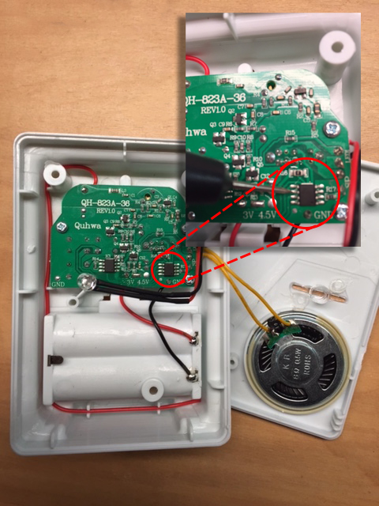

# Motion Sensor to WeMo

### Project Goals:
* turn ON one (or more) exterior lights by detection motion
* ability to manually turn lights ON and have them stay ON
* use existing exterior house lights
* experiment with the [Universal Windows Platform IoT Development][windows_iot] on the Raspberry Pi 2

### Items Used:
* [1byone Wireless Driveway Alert Doorchime Kit][amazon_1byone_battery_doorchime] (battery operated version)
* [Microsoft IoT Pack][adafruit_msiotpack]
* [Ace Hardware Waterproof Case][ace_hardware_waterproof_case]
* [Belkin WeMo Light Switch][belkin_wemo_lightswitch]

###Project Steps
* Setup the Raspberry Pi 2
    * Setup Windows using the IoT Dashboard app - OS boots up, configured on the WiFi network (the same WiFi that the WeMo Light Switches are on)
    * Build the project and deploy it to the Raspberry Pi 2
* Setup the Doorchime
    * Pre-test doorchime with batteries (to ensure the motion sensor is paired to the doorchime properly)
    * I setup doorchime to the "LED Flash" setting when the motion is detected, nice for debugging
    * Disconnected the speaker and the wires connected to the battery holder
* Setup the case
    * cut holes in case to handle power, hdmi, mouse and keyboard
    * Drill holes to and mount the Raspberry Pi 2 and the doorchime circuit board
* Connect doorchime circuit board to the Raspberry Pi 2 ([Pin Mappings][windows_iot_rpi2pinout])
    * Connect the Red Wire to +3.3V PWR (Pin 1)
    * Connect the Black Wire to GND (Pin 6)
    * Solder a wire on to the trigger line on the doorchime circuit board (see image below), connect to GPIO #21 (Pin 40)
* Run and setup the Application
    * Startup the Application using the web-based management tool under the Apps section (tool can be found on port 8080 of the Raspberry Pi 2's IP address, e.g. http://192.168.1.108:8080/)
    * Using a mouse, on the Raspberry Pi 2, select the WeMo's found on your network and drag them in to the Devices section of the Program.
    * Enter in the GPIO Pin # of where the doorchime circuit board is connected (e.g. 21)
    * Test by tripping the Motion Detector

###Motion Trigger Pin

###Finished Project

  [adafruit_msiotpack]: https://www.adafruit.com/windows10iotpi2  "Microsoft IoT Pack for Raspberry Pi 2"
  [amazon_1byone_battery_doorchime]: http://amzn.com/B00RCSU23S "1byone Wireless Driveway Alert - Infrared Motion Sensor Doorbell - One Receiver and one Sensor"
[windows_iot]: https://dev.windows.com/en-us/iot "Windows 10 IoT"
[ace_hardware_waterproof_case]: http://www.acehardware.com/product/index.jsp?productId=67569476 "Ace Hardware Waterproof Case"
[windows_iot_rpi2pinout]: http://ms-iot.github.io/content/en-US/win10/samples/PinMappingsRPi2.htm "Raspberry Pi 2 Pin Mappings"
[belkin_wemo_lightswitch]: http://www.belkin.com/us/p/P-F7C030/ "Belkin WeMo Light Switch"
